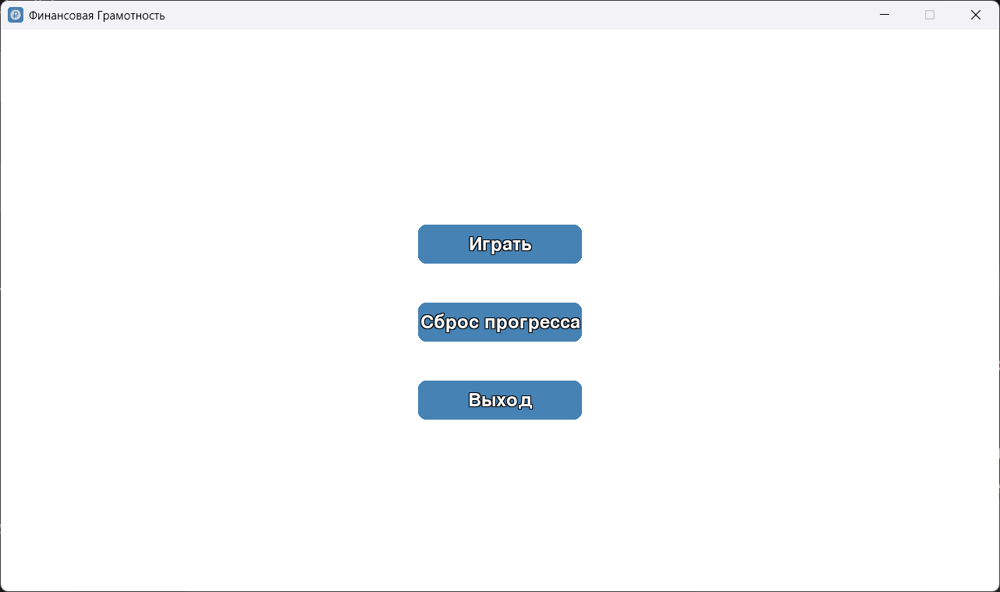
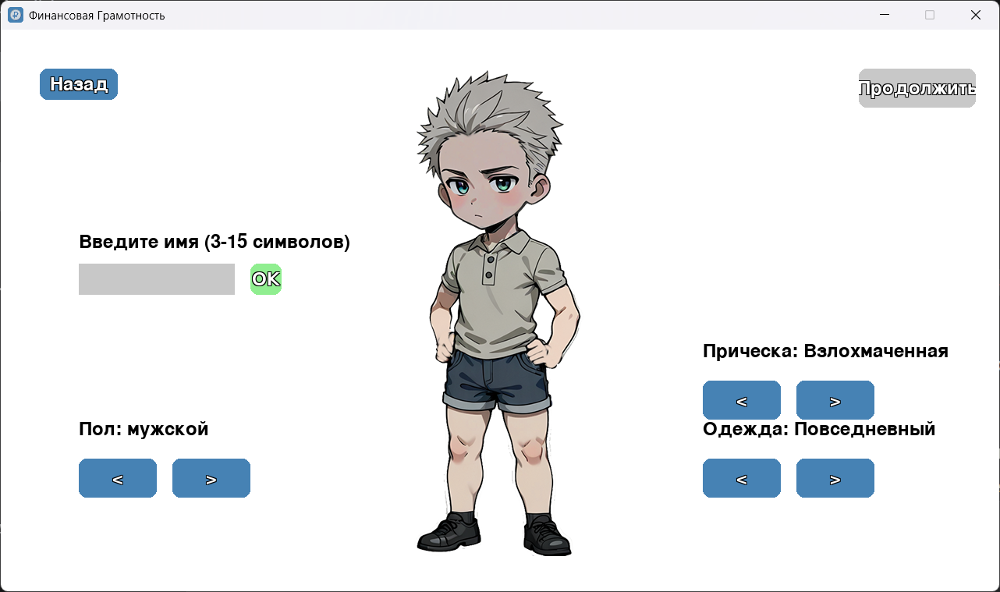
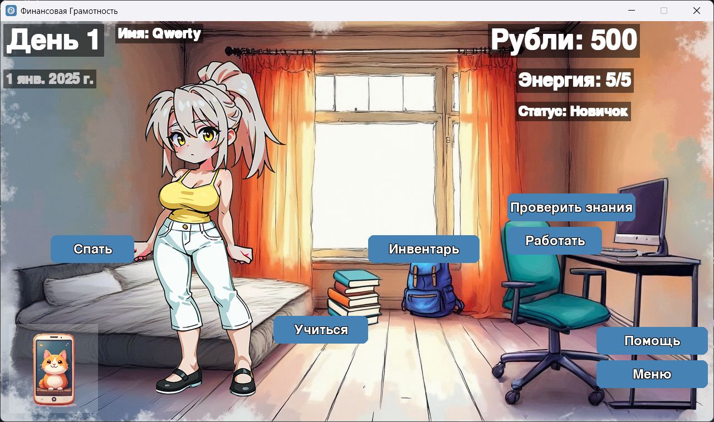
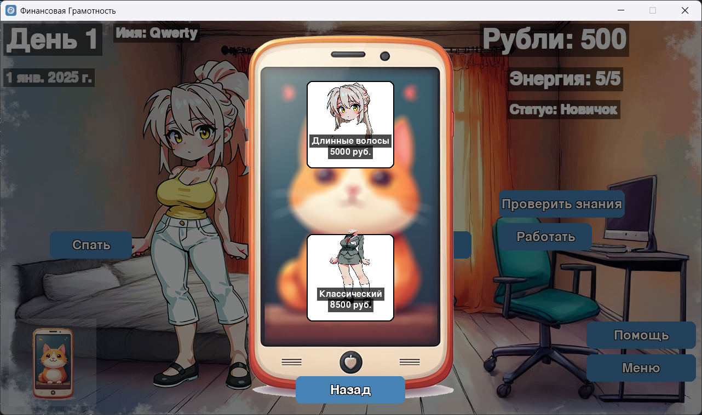
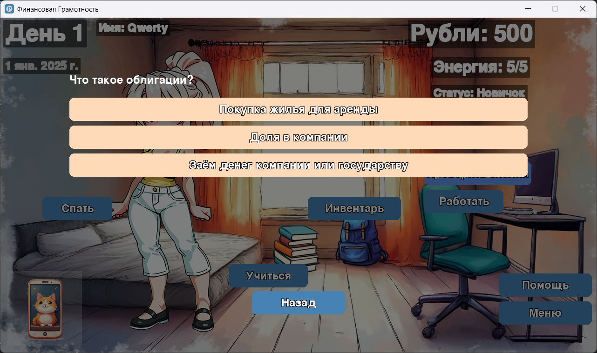
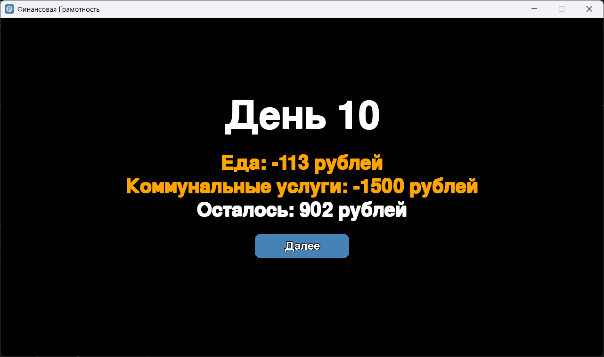

# financial-literacy-game

**Учебная игра-симулятор на Python + Pygame:** игрок зарабатывает, учится, платит налоги и проходит тесты по финансовой грамотности. Прогресс сохраняется в SQLite и переживает перезапуск игры. (дипломный проект)

---

## 📌 Описание проекта

Игрок создаёт персонажа (пол, внешность, никнейм) и живёт по игровому календарю, начиная с 1 января 2025 г. Каждое действие — баланс между энергией, временем и деньгами: работа приносит доход, но тратит энергию; учёба открывает доступ к тестам; пройденные тесты повышают статус и увеличивают зарплату.

**Цель:** пройти все 7 тестов и дорасти до статуса «Мудрец», не обанкротившись.

---

## 📸 Скриншоты








---

## 🛠️ Технологии

- **Язык:** Python 3
- **Библиотека:** Pygame (окно, события, отрисовка)
- **База данных:** SQLite — схема нормализована до 3НФ, транзакции, внешние ключи
- **Сборка:** PyInstaller (portable .exe для Windows, установка не требуется)

---

## ⚙️ Как это работает

1. Игрок создаёт персонажа: выбирает пол, причёску, одежду и вводит никнейм (3–15 символов).
2. В комнате доступны действия:
   - **Работа** — тратит 3 энергии, даёт 150–300 ₽ + бонус от статуса (до +1200%);
   - **Учёба** — тратит 2 энергии, читает темы (бюджет, инвестиции, кредиты, налоги); каждые 5 уроков — стипендия 600 ₽;
   - **Тесты** — 7 уровней сложности, покупаются за рубли, 10 случайных вопросов из банка из 48; награда только за идеальный результат 10/10;
   - **Магазин** (в телефоне) — покупка причёсок и одежды, предметы навсегда остаются в инвентаре;
   - **Сон** — восстанавливает энергию и переводит на следующий день.
3. Каждый день списываются расходы: еда 100–300 ₽, коммунальные услуги 1500 ₽ (10-е число), налог 500 ₽ (20-е число); в праздники еда стоит вдвое дороже.
4. Если рубли закончились — экран «Провал» и сброс сохранения.
5. Всё состояние (деньги, энергия, разблокировки, тесты) атомарно сохраняется в SQLite.

---

## 🚀 Запуск

**Готовая сборка:** скачай `Финансовая Грамотность.exe` из [последнего релиза](../../releases) и запусти — установка не требуется.

**Из исходников:**
```bash
pip install pygame
python main.pyw
```

---

## 📂 Структура проекта

```
financial-literacy-game/
├── main.pyw            # Точка входа: инициализация БД, главное меню
├── constants.py        # Окно, цвета, шрифты, экономика баланса, календарь
├── content_texts.py    # Обучающие тексты (контент отделён от кода)
├── content_questions.py# Банк из 48 вопросов по 4 модулям
├── db.py               # Слой данных: схема 3НФ, транзакции, каталоги (единый источник правды)
├── entities.py         # Avatar (модель игрока), редакторы внешности
├── ui.py               # Виджеты и оверлейные окна (тесты, магазин, телефон)
├── screens.py          # Экраны: меню, создание персонажа, комната, инвентарь
├── assets/             # Изображения: фон комнаты, телефон, части аватара
├── screenshots/        # Скриншоты для README
├── build_exe.bat       # Сборка .exe через PyInstaller
├── icon.ico            # Иконка приложения
├── LICENSE             # Лицензия (MIT)
└── .gitignore          # Исключаемые файлы (сборки, кэш, game.db)
```

### База данных (3НФ)

```
players        — одна строка на сохранение, только скалярные атрибуты
items          — каталог предметов
tests          — каталог тестов
player_items   — M:N «игрок ↔ разблокированные предметы»
player_tests   — M:N «игрок ↔ тесты» (флаги purchased / completed)
```

Принципы: списки не хранятся строками в колонках (1НФ); статус игрока не хранится — выводится из числа пройденных тестов; каталоги предметов и тестов существуют в единственном экземпляре (в `db.py`), UI-списки вычисляются из них.

---

## 📈 Результат

- Спроектировала и реализовала полноценную игровую экономику: доходы, расходы, налоги, бонусы статусов, 7 уровней тестов и магазин — всё сбалансировано так, чтобы прогресс нельзя было закольцевать за один день.
- Спроектировала схему SQLite до третьей нормальной формы: внешние ключи, каскадное удаление, атомарные транзакции при сохранении.
- Настроила сборку portable-исполняемого файла через PyInstaller: ресурсы через `sys._MEIPASS`, сохранения — рядом с exe через `sys.frozen`.
- В ходе рефакторинга устранила дублирование игровых данных (стартовый капитал, каталоги товаров и тестов) по принципу единственного источника правды.
